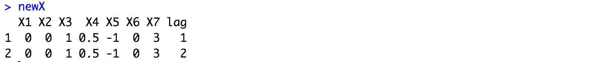
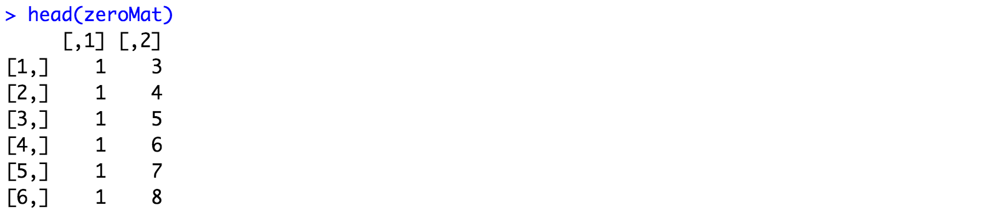

# HeterogeneousTEpanel

This is an R package to implement the ideas in Antonelli et. al (2021) to estimate time-varying and heterogeneous (with respect to covariates) causal effects of policies that are rolled out in a staggered manner. The manuscript can be found at

https://arxiv.org/pdf/2006.07681.pdf

Please don't hesitate to contact Joseph Antonelli with any questions at jantonelli111@gmail.com. Please report any bugs if you encounter any as well!

## How to install HeterogeneousTEpanel

The first thing we need to do is install the library, which can be done using the following

```
library(devtools)
install_github(repo = "jantonelli111/HeterogeneousTEpanel")
library(HeterogeneousTEpanel)
```

## Highlighting the structure of the data with a simple example

To illustrate the use of the R package, and the structure of the data that is required, we will simulate a running toy example. First, we can set the dimensions of the data, which in this case will include 70 subjects measured over 60 time points. We also generate 7 covariates. 

```
N = 70
TT = 60
Q=7
```

We can first simulate covariates, which can simply be stored in a matrix or data frame with dimensions N by Q.

```
covariates = data.frame(scale(matrix(rnorm(N*Q), N, Q)))
names(covariates) = paste("X", 1:Q, sep="")
```

An important aspect of the package is the structure of the treatment and outcome information. Both of these are stored in an N by TT matrix. We can start with the treatment matrix, which is a binary matrix whether units are treated at a particular point in time. Note that this package works for staggered adoption settings where once the treatment is initiated, units can not revert back to the control condition. In this section we simulate a random start time for each unit, and they are treated at all subsequent times.

```
treatments = matrix(0, N, TT)

startTimes = sample(40:49, N, replace=TRUE)

for (i in 1 : nrow(treatments)) {
  startTime = startTimes[i]
  treatments[i,startTime : TT] = 1
}
```

Now we can generate the outcome matrix. We will use an autoregressive model to simulate outcomes here, but the important thing is that this matrix is an N by TT matrix of outcome values for each unit and time combination. First we generate a matrix that has the mean of the outcomes, which includes the treatment effect. Note that the treatment effect is a function of the covariates.

```
meanMatrix = outcomes = matrix(NA, N, TT)

deltaQ = c(30, 20, 15, 10, 5, 0, 0, 0, 0, 0)
beta = c(0,0,0,0,3,6,9)

for (i in 1 : N) {
  meanMatrix[i,] = 400 - (1:TT)
  meanMatrix[i,startTimes[i] : (startTimes[i] + 9)] = 
    meanMatrix[i,startTimes[i] : (startTimes[i] + 9)] +
    deltaQ + sum(covariates[i,]*beta)
}
```

So in this setting, the sample average treatment effect at each time point is given by deltaQ. Beta is a vector of coefficients that determine how much the covariates affect the treatment effect. Also here, the treatment only impacts the outcome 10 time periods into the future. Now we can add residual variation that is correlated across individuals and time. First we create a covariance matrix across individuals at each point in time:

```
rho = 0.8
cov_sigma  = matrix(NA, N, N)
for (i in 1 : N) {
  for (j in 1 : N) {
    cov_sigma[i,j] = 400*(rho^abs(i-j))
  }
}

diag(cov_sigma) = 400
```

Now, we can create temporal dependence and dependence across units as follows:

```
outcomes[,1] = meanMatrix[,1] + as.numeric(mvtnorm::rmvnorm(1, sigma=cov_sigma))

for (j in 2 : ncol(outcomes)) {
  outcomes[,j] = meanMatrix[,j] + Amat %*% (outcomes[,j-1] - meanMatrix[,j-1]) + 
    as.numeric(mvtnorm::rmvnorm(1, sigma=cov_sigma))
}
```

## Using the main functions

Now that we have the structure of the three key inputs, we can move forward with utilizing the software to estimate treatment effects. There are a couple of other optional inputs one might want to use within this function. The first is called newX and this is a set of new covariate values to estimate the treatment effect at. An example of newX is given below:

```
newX = data.frame(X1 = c(0,0),
                   X2 = c(0,0),
                   X3 = c(1,1),
                   X4 = c(0.5,0.5),
                   X5 = c(-1,-1),
                   X6 = c(0,0),
                   X7 = c(3,3),
                   lag = c(1,2))
newX
```


Note that this should have the same structure and variable names as covariates. This should also have an additional column called lag, which refers to how many time points after treatment we are considering. In this example we are estimating the treatment effect at the same covariate values over two different time points.

Another parameter is called zeroMat, which is a set of indices that should have zeroes in the inverse of the covariance matrix for the N individuals at each point in time. Note that one can set this parameter to NULL and no sparsity will be enforced, but this will lead to unstable results in settings with large N and small TT. In this example, we will set all indices of the precision matrix to be zero except for first order neighbors (observations whose indices are only 1 apart). 

```
zeroMat = matrix(c(1,1,2,2), nrow=2)
for (i in 1 : (nrow(outcomes) - 1)) {
  for (j in i : nrow(outcomes)) {
    zeroMat = rbind(zeroMat, c(i,j))
  }
}

w = which(abs(zeroMat[,1] - zeroMat[,2]) < 2)
zeroMat = zeroMat[-w,]
head(zeroMat)
```




